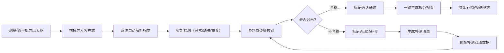
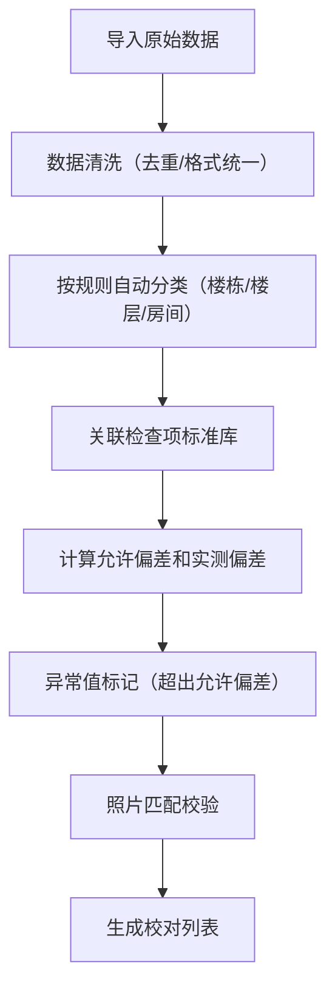

## 1. 产品概述

质量实测实量离线桌面客户端，专为建筑工地资料员和质量员设计，解决网络不稳定环境下现场测量数据的整理、校对和报表生成问题。支持测量表格拖拽导入、自动分类归档、异常值智能检测、补测清单管理及一键生成规范报表，大幅减少手工复制粘贴和资料返工。

- **核心目标**：实现实测实量数据的本地化、自动化、规范化管理
- **目标用户**：建筑工地资料员、质量员、项目部管理人员
- **使用场景**：项目部办公室，网络不稳定或甲方要求留存本地台账的工地

## 2. 核心功能

### 2.1 用户角色

| 角色 | 注册方式 | 核心权限 |
|------|----------|----------|
| 资料员 | 本地创建账号 | 数据导入、校对、报表生成、数据导出 |
| 质量员 | 本地创建账号 | 数据导入、标记补测、查看补测清单 |

### 2.2 功能模块

1. **导入校对窗口**：文件拖拽导入、数据自动分类、异常值检测、缺失照片标记、重复点位识别、逐条校对、补测标记
2. **补测清单窗口**：待补测列表、补测状态管理、补测数据回填、补测清单导出
3. **报表生成窗口**：分户实测表生成、楼层汇总表生成、质量整改台账生成、批量导出

### 2.3 页面详情

| 页面名称 | 模块名称 | 功能描述 |
|---------|---------|----------|
| 导入校对 | 文件导入区 | 支持拖拽 Excel/CSV 文件，显示导入进度和数据统计 |
| 导入校对 | 分类导航树 | 按楼栋→楼层→房间→检查项层级展示数据 |
| 导入校对 | 数据校对表格 | 展示测点编号、设计值、实测值、允许偏差、偏差值、照片状态 |
| 导入校对 | 异常筛选器 | 快速筛选超差值、缺失照片、重复点位、未校对数据 |
| 导入校对 | 校对操作区 | 标记"需现场补测"、添加备注、确认通过 |
| 补测清单 | 补测列表 | 展示所有待补测点位信息、补测原因、责任人、期限 |
| 补测清单 | 状态管理 | 标记补测状态（待补测/已补测/已复核） |
| 补测清单 | 数据回填 | 录入补测数据、上传补测照片 |
| 补测清单 | 清单导出 | 导出补测通知单、补测完成报告 |
| 报表生成 | 报表类型选择 | 分户实测表、楼层汇总表、质量整改台账 |
| 报表生成 | 筛选条件 | 按楼栋、楼层、检查项、时间范围筛选 |
| 报表生成 | 报表预览 | 在线预览生成的报表样式和数据 |
| 报表生成 | 批量导出 | 支持 Excel/PDF 格式导出，保留规范格式 |

## 3. 核心流程

### 3.1 主业务流程

### 3.2 数据处理流程

## 4. 用户界面设计

### 4.1 设计风格

- **主色调**：深蓝色（#1E40AF）代表专业可靠，搭配深灰色（#374151）体现稳重规范
- **辅助色**：绿色（#059669）表示合格，红色（#DC2626）表示异常，橙色（#D97706）表示待补测
- **按钮风格**：方形微圆角，1px 边框，hover 状态有轻微阴影，强调稳重感
- **字体**：系统无衬线字体（Microsoft YaHei / PingFang SC），表格数据使用等宽数字字体
- **布局风格**：三栏布局（左侧导航树+中间数据区+右侧详情面板），顶部功能工具栏
- **图标风格**：线性图标，简洁规范，避免过度装饰

### 4.2 页面设计概述

| 页面名称 | 模块名称 | UI 元素 |
|---------|---------|---------|
| 导入校对 | 文件导入区 | 虚线边框拖拽区域，大尺寸上传图标，支持点击选择文件 |
| 导入校对 | 分类导航树 | 可折叠树形结构，节点显示数量统计徽章 |
| 导入校对 | 数据校对表格 | 斑马纹行，异常行红色背景高亮，照片缩略图列 |
| 导入校对 | 异常筛选器 | 标签式筛选按钮，显示各类异常数量 |
| 补测清单 | 补测列表 | 卡片式或表格展示，状态标签颜色区分，进度条显示完成率 |
| 报表生成 | 报表预览 | 仿真 Excel 样式预览，分页显示，支持缩放 |

### 4.3 响应式设计

- **桌面优先**：优化 1920×1080 及以上分辨率显示
- **自适应**：三栏布局支持拖拽调整宽度，表格支持水平滚动
- **触控优化**：按钮最小高度 32px，操作区预留充足间距

### 4.4 数据校验规则

- **测点编号**：格式为「楼栋-楼层-房间-检查项-序号」，如 1#-10F-1001-墙面垂直度-001
- **允许偏差**：关联国家规范和企业标准，自动计算上下限
- **异常判定**：实测值超出 [设计值-允许负偏差, 设计值+允许正偏差] 范围即为异常
- **重复点位**：同一测点编号出现多次即为重复
- **缺失照片**：应有照片但未上传的测点
