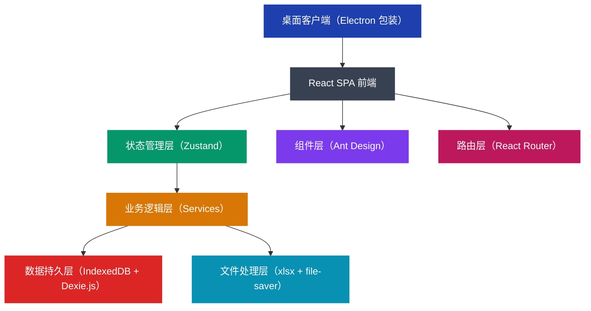
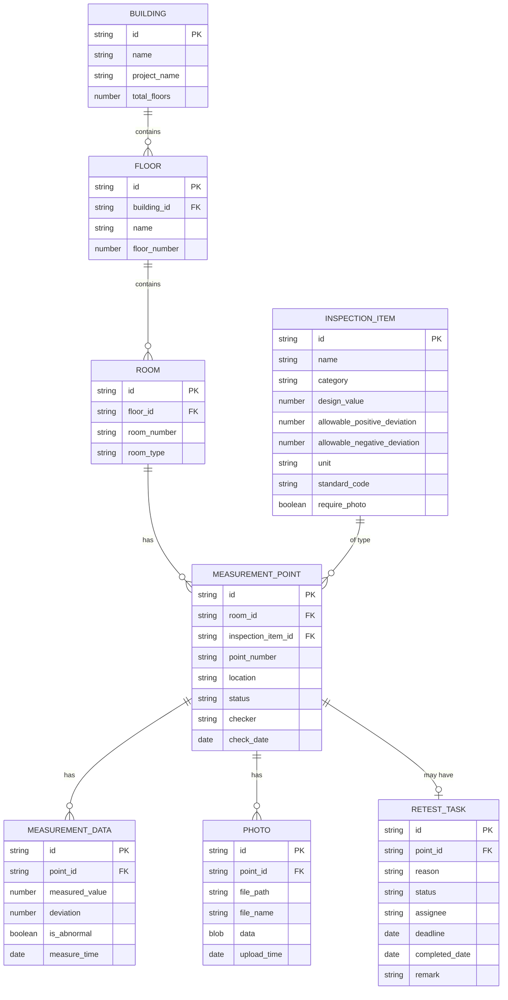

## 1. 架构设计



## 2. 技术描述

- **前端框架**：React@18 + TypeScript@5
- **构建工具**：Vite@5
- **UI 组件库**：Ant Design@5（企业级组件，符合稳妥规范调性）
- **状态管理**：Zustand@4（轻量级，适合本地应用）
- **本地数据库**：IndexedDB + Dexie.js@3（离线数据持久化）
- **路由管理**：React Router@6
- **文件处理**：
  - xlsx@0.18（Excel/CSV 解析与导出）
  - file-saver@2（文件下载）
  - jszip@3（照片打包导出）
- **样式方案**：TailwindCSS@3 + CSS Modules
- **桌面包装**：Electron@28（可选，用于发布桌面客户端）

## 3. 路由定义

| 路由 | 页面 | 用途 |
|------|------|------|
| / | 导入校对 | 默认首页，文件拖拽导入与数据校对 |
| /retest | 补测清单 | 待补测点管理与数据回填 |
| /reports | 报表生成 | 各类报表的预览与导出 |
| /settings | 系统设置 | 检查项标准库配置、数据备份恢复 |

## 4. 数据模型

### 4.1 ER 图



### 4.2 数据存储设计

```typescript
// 检查项标准库
interface InspectionItem {
  id: string;
  name: string;           // 检查项名称，如"墙面垂直度"
  category: string;       // 分类：墙面、地面、顶棚、门窗等
  designValue: number;    // 设计值
  allowablePositiveDeviation: number;  // 允许正偏差
  allowableNegativeDeviation: number;  // 允许负偏差
  unit: string;           // 单位，如 mm
  standardCode: string;   // 规范编号，如 GB50210-2018
  requirePhoto: boolean;  // 是否需要照片佐证
}

// 测点
interface MeasurementPoint {
  id: string;
  buildingId: string;
  buildingName: string;
  floorId: string;
  floorName: string;
  roomId: string;
  roomNumber: string;
  inspectionItemId: string;
  inspectionItemName: string;
  pointNumber: string;    // 测点编号：1#-10F-1001-墙面垂直度-001
  location: string;       // 具体位置描述
  designValue: number;
  measuredValue: number;
  allowablePositiveDeviation: number;
  allowableNegativeDeviation: number;
  deviation: number;
  isAbnormal: boolean;
  isDuplicate: boolean;
  hasPhoto: boolean;
  photoPath?: string;
  status: 'pending' | 'approved' | 'retest_required';
  checker: string;
  checkDate: string;
  remark?: string;
  importBatchId: string;
  createdAt: string;
  updatedAt: string;
}

// 补测任务
interface RetestTask {
  id: string;
  pointId: string;
  pointNumber: string;
  reason: string;         // 补测原因
  status: 'pending' | 'completed' | 'verified';
  assignee: string;       // 责任人
  deadline: string;
  completedDate?: string;
  retestValue?: number;
  retestPhotoPath?: string;
  remark?: string;
}

// 导入批次
interface ImportBatch {
  id: string;
  fileName: string;
  fileSize: number;
  totalCount: number;
  validCount: number;
  abnormalCount: number;
  missingPhotoCount: number;
  duplicateCount: number;
  importedAt: string;
  importedBy: string;
}
```

## 5. 核心模块结构

```
src/
├── components/           # 公共组件
│   ├── layout/          # 布局组件
│   ├── table/           # 数据表格组件
│   ├── form/            # 表单组件
│   └── common/          # 通用组件（上传、预览等）
├── pages/               # 页面组件
│   ├── ImportVerify/    # 导入校对页面
│   ├── RetestList/      # 补测清单页面
│   └── ReportGenerate/  # 报表生成页面
├── store/               # 状态管理
│   ├── useDataStore.ts
│   ├── useImportStore.ts
│   └── useReportStore.ts
├── services/            # 业务逻辑层
│   ├── importService.ts    # 文件导入与解析
│   ├── dataService.ts      # 数据 CRUD 操作
│   ├── classifyService.ts  # 自动分类逻辑
│   ├── verifyService.ts    # 数据校验与异常检测
│   ├── retestService.ts    # 补测任务管理
│   └── reportService.ts    # 报表生成逻辑
├── db/                  # 数据库层
│   ├── index.ts         # Dexie 数据库实例
│   └── schema.ts        # 数据库表定义
├── types/               # TypeScript 类型定义
├── utils/               # 工具函数
│   ├── excel.ts         # Excel 处理工具
│   ├── classifier.ts    # 分类规则引擎
│   └── validator.ts     # 数据校验工具
├── constants/           # 常量配置
│   ├── inspectionItems.ts  # 检查项标准库
│   └── rules.ts            # 业务规则配置
├── assets/              # 静态资源
├── App.tsx
└── main.tsx
```

## 6. 关键技术决策

### 6.1 离线数据存储方案
- **选型**：IndexedDB + Dexie.js
- **理由**：支持大容量本地存储（>50MB），异步 API 不阻塞 UI，Dexie.js 提供了类似 MongoDB 的查询 API，开发体验好

### 6.2 Excel 处理方案
- **选型**：xlsx (SheetJS)
- **理由**：纯前端解析 Excel，无需后端服务，支持 .xlsx/.xls/.csv 多种格式

### 6.3 UI 组件库
- **选型**：Ant Design 5
- **理由**：企业级组件库，风格稳重规范，表格、树形、上传等组件功能完善，符合工地项目部的使用习惯

### 6.4 状态管理
- **选型**：Zustand
- **理由**：轻量级（约 1KB），API 简洁，支持 Immer 进行不可变更新，适合本地桌面应用

### 6.5 桌面打包（可选）
- **选型**：Electron
- **理由**：可以将 Web 应用打包为 Windows 桌面客户端，支持桌面快捷方式、系统通知等原生能力

## 7. 核心算法

### 7.1 数据自动分类算法
```
输入：原始测量数据行（包含楼栋、楼层、房间号、检查项等字段）
输出：标准化的 MeasurementPoint 对象

步骤：
1. 字段映射：将导入表格的列名映射到标准字段名
2. 楼栋识别：正则匹配楼栋号（如 1#、2栋、3号楼）
3. 楼层识别：正则匹配楼层（如 10F、10层、-1F）
4. 房间识别：正则匹配房间号（如 1001、10-01）
5. 检查项匹配：模糊匹配检查项标准库
6. 测点编号生成：按规则拼接唯一编号
7. 偏差计算：measuredValue - designValue
8. 异常判定：deviation > allowablePositive 或 deviation < allowableNegative
```

### 7.2 重复点位检测算法
```
输入：当前批次所有测点
输出：标记重复的测点

步骤：
1. 按 pointNumber 分组
2. 每组数量 > 1 则标记为重复
3. 保留第一条，其余标记 isDuplicate = true
4. 重复数据建议合并或删除
```

### 7.3 报表生成算法
```
输入：筛选条件（楼栋、楼层、检查项、时间范围）
输出：报表数据结构

分户实测表：
1. 按房间分组
2. 每个房间按检查项分组
3. 展示测点编号、设计值、实测值、允许偏差、偏差值、检查人、日期

楼层汇总表：
1. 按楼层分组
2. 每个检查项统计：实测点数、合格点数、合格率、最大偏差、最小偏差
3. 生成合格率趋势图

质量整改台账：
1. 筛选所有异常数据和补测数据
2. 按严重程度排序
3. 展示问题描述、整改要求、责任人、完成状态
```
